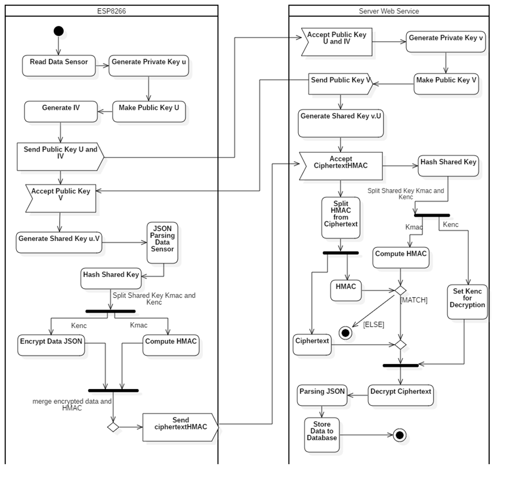

# ecies-esp8266

This project is for my academic purpose while i am still undergraduated
The purpose for this project is to encrypt data IoT in ESP8266 using Elliptic Curve Integrated Encryption Scheme (ECIES)

## Algorithm
Elliptic Curve for this project is secp256k1

Algorithm Simetric for this project is using AES-128-CBC

Hashing Algorithm is using SHA-256

##Program Flow

